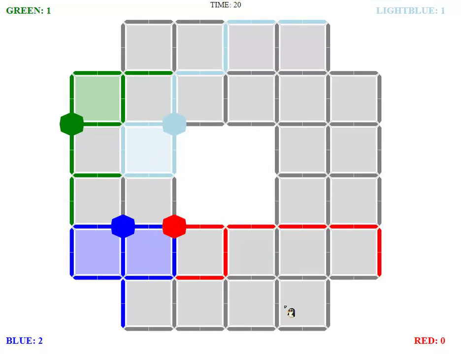

# MilestO-W-N

Play with up to four people at once!

It's complicated in some ways, simple in others. I came up with the idea of dynamic map generation from matrices and decided to implement it by looping through each item in a loop of each rows. See [`assets/data/maps.json`](https://github.com/moefingers/UNLV-MilestO-W-N/blob/shepherd/assets/data/maps.json), there's some player spawn information since dynamically picking fair spawns on maps with varying levels of complexity would be too convoluted.

Now deployed on GitHub. \
[Play now!](https://moefingers.github.io/UNLV-MilestO-W-N/)